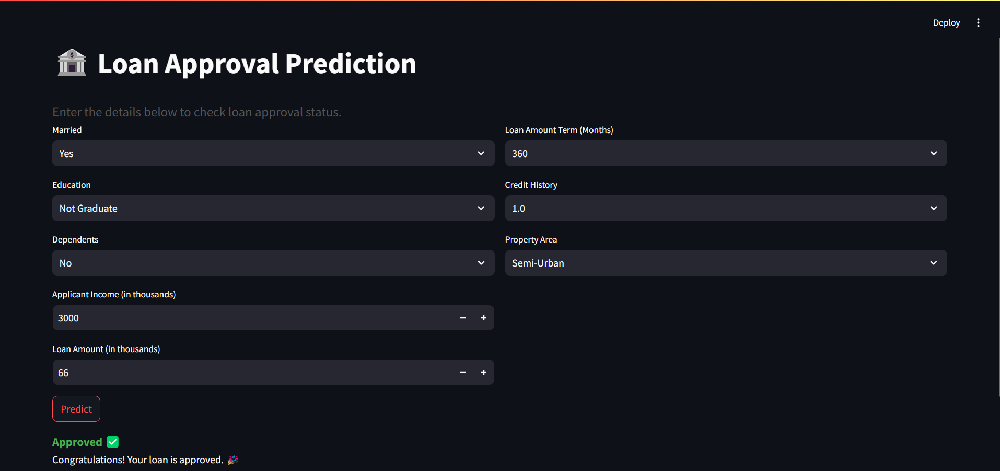

# Loan Approval Prediction 🏦

## 🚀 Project Overview
This project is a **Loan Approval Prediction System** that uses **Machine Learning** to determine whether a loan application should be approved or rejected based on various factors. It is deployed using **Streamlit** for an interactive user experience.

## 🏗️ Tech Stack
- **Python** (Pandas, NumPy, Scikit-Learn, Matplotlib, Seaborn)
- **Machine Learning Models:** Logistic Regression, Random Forest, XGBoost
- **Deployment:** Streamlit

## 📂 Dataset Overview
The dataset includes information such as:
- **Loan_ID** (Unique Identifier)
- **Married** (Yes/No)
- **Education** (Graduate/Not Graduate)
- **ApplicantIncome** & **CoapplicantIncome**
- **LoanAmount** & **Loan_Amount_Term**
- **Credit_History** (1: Good, 0: Bad)

## 🛠️ Features & Workflow
1. **Data Preprocessing:**
   - Handling missing values using `SimpleImputer`
   - Encoding categorical variables using `LabelEncoder`
2. **Feature Selection:**
   - Removing unnecessary columns
   - Selecting key features based on correlation analysis
3. **Model Training:**
   - Trained on **Logistic Regression, Random Forest, and XGBoost**
   - Evaluated using **Confusion Matrix and Classification Report**
4. **Deployment with Streamlit:**
   - User-friendly interface for predicting loan approval
   - Visualizations for model insights

## 📊 Model Performance
| Model | Accuracy |
|--------|-----------|
| Logistic Regression | 80% |
| Random Forest | 80% |
| XGBoost | 75%
## 🚀 How to Run the Project
### 🔹 1. Clone the Repository
```sh
git clone https://github.com/Murugavl/Loan_Approval_Prediction.git
cd Loan_Approval_Prediction
```

### 🔹 2. Install Dependencies
```sh
pip install -r requirements.txt
```

### 🔹 3. Run the Streamlit App
```sh
streamlit run app.py
```

## 📌 Demo Screenshot


---
⭐ **Star this repo if you find it useful!** 🚀
